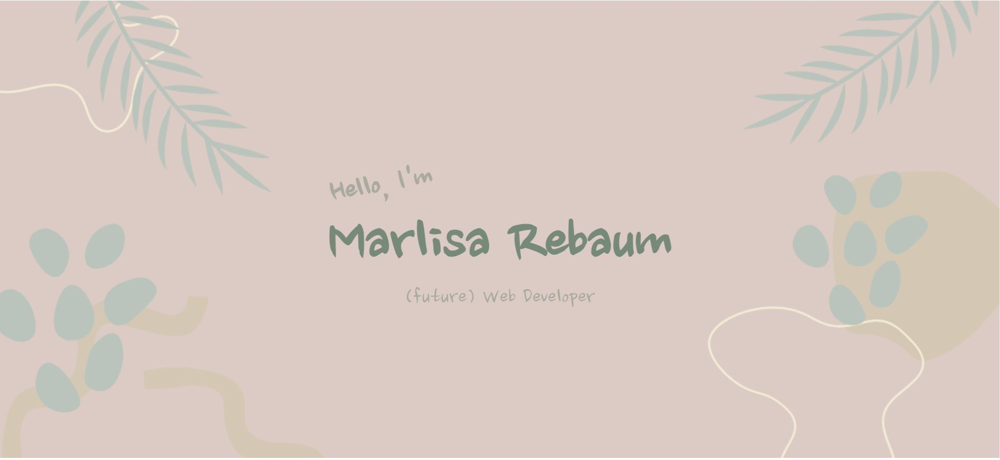
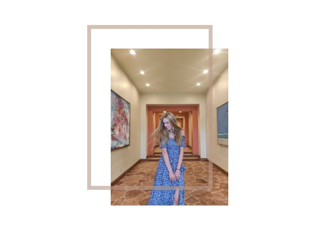
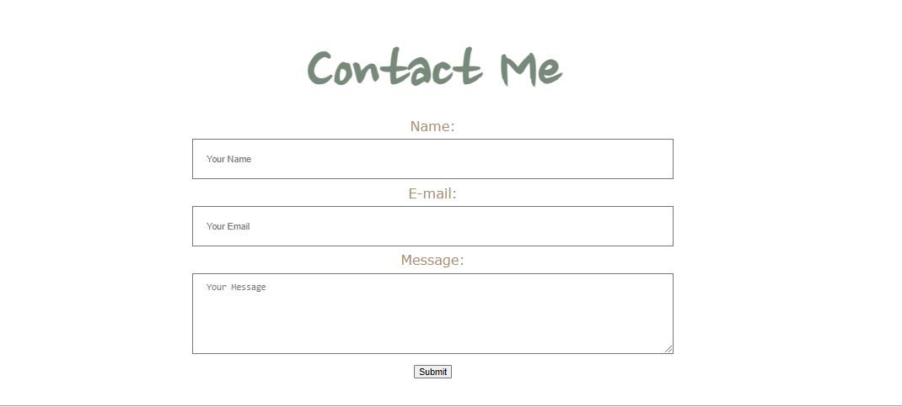

# Portfolio (HTML/CSS Only)
> This HTML/CSS-only portfolio is the first project I created for Coding Temple, 
the full-stack software engineering bootcamp I attended. This was my first attempt
at using HTML and CSS to share a little about myself.

> You can find a live demo [_here_](https://marlisarebaum.github.io/prework-portfolio/).

## Table of Contents
* [General Info](#general-information)
* [Technologies Used](#technologies-used)
* [Screenshots](#screenshots)
* [Project Status](#project-status)
* [Room for Improvement](#room-for-improvement)
* [Contact](#contact)

## General Information
The task for this project was to use CSS grid and create a simple HTML and CSS 
portfolio. The purpose was to practice using CSS grid and be creative with the 
styling to really show who we are. The portfolio had to include the following:

- a navbar
- a hero image with text
- "about me" section
- at least one use of CSS grid
- (non-functional) contact form

I used this project as an opportunity to get creative with my CSS. For example,
I practiced rotating text using transform: rotate(-10deg) and practice having an
offset border on my images, played around with transparency, etc.

## Technologies Used

## Screenshots
Practice Using a Hero Image and Overlaying Text on Images:

Practice Creating an Offset Border Using CSS:

First Form I Created Using HTML:

## Project Status
Project is:  _complete_ 

## Room for Improvement
As this is the a first HTML/CSS project, there are lots of areas of improvement.

Three areas of improvement include:
- Make the site responsive.
- Add a backend to make the form functional.
- Change the colors, fonts, etc. to increase accessibility.

## Contact
Created by [Marlisa Rebaum](https://www.linkedin.com/in/marlisarebaum/) - feel free to contact me!